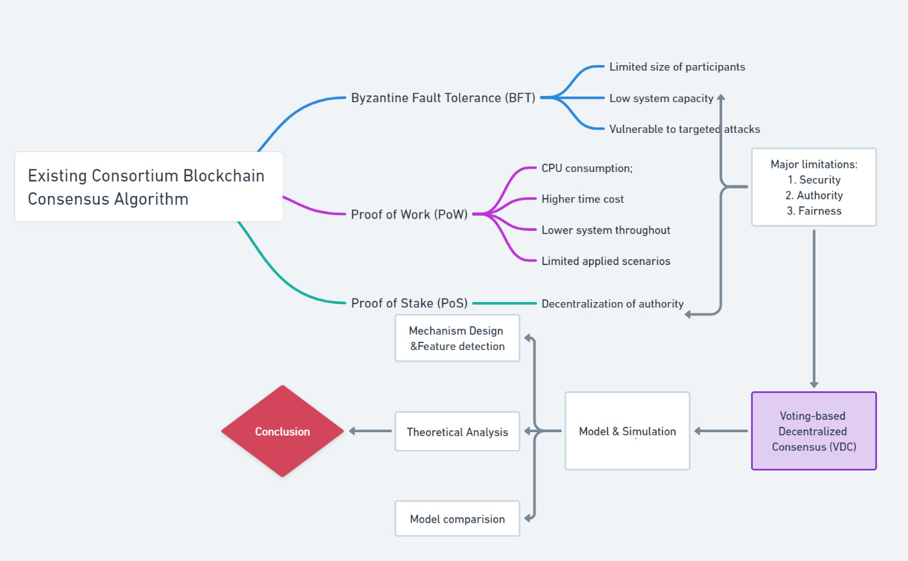
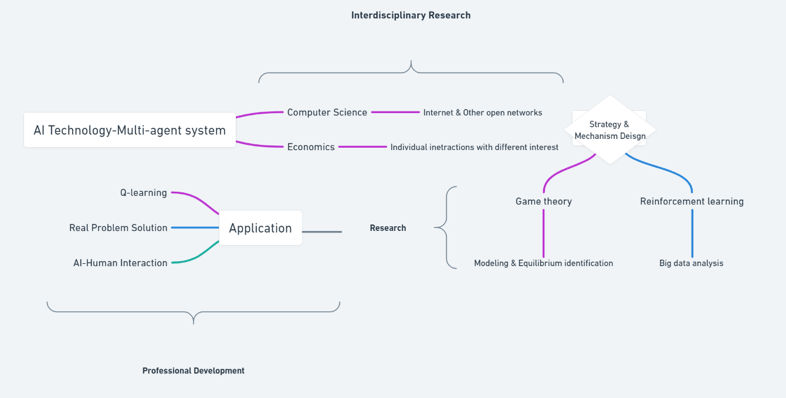

# The Future of Computional Microeconomics: Comments for "[The title of the article of your choices](URL)"

> *Disclaimer: Submissions to the Final Project for [COMPSCI/ECON 206 Computational Microeconomics](https://ce.pubpub.org/), 2022 Spring Term (Seven Week - Second) instructed by [Prof. Luyao Zhang](http://scholars.duke.edu/person/luyao.zhang) at Duke Kunshan University.*

## Citation of the Article 

Sun, Gang, Miao Dai, Jian Sun, and Hongfang Yu. 2021. “Voting-Based Decentralized Consensus Design for Improving the Efficiency and Security of Consortium Blockchain.” IEEE Internet of Things Journal 8 (8): 6257–72. https://doi.org/10.1109/jiot.2020.3029781.

in BibTex
```
@ARTICLE{9219122,
  author={Sun, Gang and Dai, Miao and Sun, Jian and Yu, Hongfang},
  journal={IEEE Internet of Things Journal}, 
  title={Voting-Based Decentralized Consensus Design for Improving the Efficiency and Security of Consortium Blockchain}, 
  year={2021},
  volume={8},
  number={8},
  pages={6257-6272},
  doi={10.1109/JIOT.2020.3029781}}

```

## 

## Part I: Summary




**Fig.1 - Summary Mindmap**

### 1. Background and Motivation

Despite that consortium blockchain holds advantages in decentralization, transparency, traceability, and the ability to be tamper-proof theoretically, it is still facing a set of dilemmas in the practical application such as high energy consumption, time inefficiency, low transaction throughput, poor security, poor user revenue fairness, which hindered the further development of blockchain technology and application [(Sun et al. 2020)](https://doi.org/10.1109/jiot.2020.3029781). Specifically, each participant maintains a copy of the blockchain account book and has equal access to transaction records in a decentralized system. This puts forward higher requirements for managing the consistency of different account books, as well as determining who is responsible for generating new blocks or judging whose blocks are reasonable and legitimate practical decisions. That makes up the core module of alliance blockchain -- consensus algorithm, which is a fault-tolerant mechanism that is used in computer and blockchain systems to achieve the necessary agreement on a single data value or a single state of the network among distributed processes or multi-agent systems [(Frankenfield 2019a)](https://www.investopedia.com/terms/c/consensus-mechanism-cryptocurrency.asp). Its efficiency and effectiveness directly affect the performance of the system. However, the current consensus algorithm can not fully match the requirements of technological development. In order to solve the related problems, this paper proposes a new consensus algorithm, mainly answering the question of how to improve the efficiency and security of the consortium blockchain to improve the performance of the blockchain platform via optimizing the quality of the core modules. 

### 2. Research Questions

This paper reviews the formation and development of existing major consensus algorithms and points out their application limitations: Proof of Work (PoW) as an original consensus algorithm that requires effort solving mathematical puzzles is used operate at the cost of additional CPU consumption, higher time cost, and lower system throughput, which cannot cope with the quality of service requirements of some scenarios [(Frankenfield 2021)](https://www.investopedia.com/terms/p/proof-stake-pos.asp). Besides, Proof of Stake (PoS), as another instrument to achieve consensus requiring participants to stake coins or set them aside to be randomly selected as a validator [(Frankenfield 2019b)](https://www.investopedia.com/terms/p/proof-stake-pos.asp), faces the problem with the decentralization of authority. Byzantine Fault Tolerance (BFT) algorithm, carrying the computer system's ability to continue operating even some of the nodes fail or act maliciously [(Daly 2021)]( https://www.fool.com/investing/stock-market/market-sectors/financials/cryptocurrency-stocks/byzantine-fault-tolerance/), is also limited by the size of participants, resulting in low system capacity and appointing leaders vulnerable to targeted attacks. At the same time, the fairness of user profit has not reached the expected level of attention. Based on the above research results and problems, this paper formulated the algorithm, voting-based decentralized consensus (VDC) of the consortium blockchain to reach better fairness in terms of user benefits and time efficiency under the condition of acceptable energy consumption without sacrificing security [(Sun et al. 2020)](https://doi.org/10.1109/jiot.2020.3029781). 

### 3. Methods

The paper adopts the Model & Simulation method and proposes a new algorithm, voting-based decentralized consensus (VDC) to improve the weakness of the existing algorithms [(Sun et al. 2020)](https://doi.org/10.1109/jiot.2020.3029781): first, the model classifies the nodes into different categories, limiting the authority to avoid monopoly and reducing the complexity of communication; Secondly, based on varifiable random function (VRF), which refers to produces publicly verifiable and unpredictable random values [(“Verifiable Random Function” 2021)](https://en.wikipedia.org/wiki/Verifiable_random_function), the algorithm includes the operation of "lottery drawing" to avoid targeted attacks. Thirdly, owners can switch frequently to ensure the fairness of the algorithm; Finally, the algorithm takes assets and reputation as rewards and punishments to establish a strict reward and punishment mechanism to regulate user behavior. In this paper, the performance of the VDC algorithm is analyzed theoretically according to the above characteristics. The influence of different parameters on VDC algorithm performance is studied through simulation experiments to ensure performance improvement. Furthermore, the simulation process also compares the VDC algorithm with PBFT and MBFT algorithm and proves that the algorithm has obvious advantages in user benefit fairness, time efficiency, and elasticity against target attack, and has acceptable extra cost in energy consumption.

### 4. Intellectual Merits

In general, the main contributions made by the new consensus algorithm include: 

-In the new consensus model, different nodes will be assigned different identities, enjoying different functions and dealing with different things. Identities can be converted to each other, so as to limit and disperse authority to avoid monopoly; 

-The new strategy determines the privileges and ownership of the packaged blocks, which utilize the dual characteristics of unpredictability and verifiable blockchain, assisting in improving the system’s strength against the targeted attacks.

-Based on the existing consensus algorithm which uses reputation and credit as incentive measures, the asset factor is introduced to the algorithm in order to further increase the cost of malicious behavior, to improve the security of the algorithm. 

### 5. Practical Impacts

The new consensus algorithm is expected to solve the drawbacks of the existing blockchain algorithms or update the existing consensus algorithm to improve the performance of the blockchain platform. However, as a newly born partial theoretical algorithm mechanism, VDC also needs further experiments and improvements to adapt to highly complex application scenarios [(Sun et al. 2020)](https://doi.org/10.1109/jiot.2020.3029781). 

## Part II: Critics 


**Fig.2 - Critics Mindmap**

### 1. Economics for Computer Science: Incentives in Computer Science

On the basis of the existing consensus algorithm using reputation and credit as incentive measures, the asset factor is introduced to further increase the cost of malicious behavior, so as to improve the security of the algorithm.  For example, if a verifier's judgment differs from that of the majority, he is judged to have made the wrong decision, the deposit he previously paid will be awarded to the person who made the right judgment, and the value of his credit list will be reduced.  

This method combines the dual factors of credit and assets to reward and punish users, which further standardizes users' behavior and strengthens their awareness of rules. In algorithm design, we should also learn from this method and set factors of different dimensions to strengthen the influence of user behavior, so as to achieve multi-directional control.  

In addition to reputation and assets, the consideration of rewards and punishments can be further increased, and the relevant mechanisms need to be further improved. How to define "crime cost" can better constrain users is also a very important topic.  

### 2. Computer Science for Economics: Practicality in Economics

In this paper, the security of the algorithm is described in detail in combination with computer applications. According to common security problems encountered in a specific practice, including Double Spending, Packing, and Targeted Attacks, the author analyzes how the FDC algorithm can better solve these security problems. Thus, the reliability of the algorithm model in practical application is verified. 

The algorithm references the "lottery" step on the basis of VRF so that the algorithm can effectively use the randomness of the computer to determine the slot owner, so as to protect him from targeted attacks. At the same time, it also improves the fairness of users' income in frequent owner switching. 

Excessive randomness in the system may increase system uncertainty and risk, and frequent slot owner changes may lead to unnecessary power consumption. 

## Part III: Inspirations





**Fig.1 - Inspirations Mindmap**

### 1. Interdisciplinary Research

Computational Economics is an integral part of the development of computers and artificial intelligence. As an important research tool in economics, game theory is usually used to study how companies adopt appropriate business strategies in market competition to achieve desired goals, while the introduction of game theory into computer science is due to the emergence of the Internet and other open networks. Under such a situation, how do we create a second intelligence? An important problem to solve is how to deal with interactions with other non-human agents [(Dafoe 2021)](https://doi.org/10.1038/d41586-021-01170-0). In the open web application, there are many different strategic interactions between entities, each entity has a different rationale and has its interests. According to the actual environment beneficial to itself, each entity decides on a strategy to realize the maximization of interests, these strategies eventually reach a limited equilibrium state. Like expert systems, writing a bunch of rules isn't a good option because that intelligence doesn't scale very well. What we hope more is to give the agent some basic rules of behavior, so that the agent can reflect its personality in the interaction and learn its skills. So how do you set these learning rules? One great tool is game theory. For example, in game theory, a multi-agent system can provide a lot of inspiration for solving existing problems, such as how to design the benefits and preferences of agents so that they can learn cooperative behaviors. Take the classic case, prisoner's dilemma, for instance, it is best for both parties not to betray, but an intelligent agent that only cares about itself will only betray. 

### 2. Research for Real-world Practices

With the progress of AI technology, more and more problems can be solved by artificial intelligence, and so can game problems. In the future, in-depth research on AI decision-making is expected to be an important development direction in the field, and game theory is a theoretical framework used to describe and analyze the interaction between multiple agents. According to the different nature of the problem, the game theory can be summarized into the following two solutions for ai decision making: One is entirely based on game theory, that is, the whole problem is modeled as a game process, and then the equilibrium is solved. It should be noted that game solving is often a large-scale optimization problem, requiring the use of a lot of operational research and optimization techniques. Another idea is to use reinforcement learning techniques to solve problems. It is appropriate and necessary to adopt non-model-based reinforcement learning when the problem cannot be well modeled by game theory, the scale is too large, or it is difficult to use optimization methods for non-convex problems.

The development of artificial intelligence is creating new possibilities for the field of game theory. At the theoretical level, artificial intelligence is providing new solutions for game theory. Take Nash equilibrium and equilibrium in cooperative game theory as examples, both of which have some difficulties in computational complexity In traditional research, it is usually necessary to solve a specific problem with a specific structure, while q-learning and other methods in reinforcement learning have brought new ideas to the calculation of equilibrium. In some practical applications, artificial intelligence has also been applied to go games and other game scenarios, such as AlphaGo supported by powerful computing power AlphaStar obtained excellent strategies through the application of the deep reinforcement learning method and defeated the top human players in the man-machine game confrontation. Moreover, artificial intelligence and reinforcement learning also provide new power for the study of game problems in the price war auction and other scenarios.

### 3. Future Professional Growth

Computer science and economics do intersect academically, especially in areas where there is a lot of math involved in the two disciplines, such as Algorithmic game theory, computational mechanism design and Multi-agent system. The future trajectory of professional development can be seen in the applications of the mentioned fields. For instance, user-generated content sites like Zhihu can combine algorithms from computer science with mechanism design from economics when considering content ranking [(Ghosh and Hummel 2014)](https://doi.org/10.1016/j.jet.2014.09.009). 

---
### **Cooporative AI Glossary Table**

| Glossary | Definition |Source|
| ----------- | ----------- |-----------|
| **Consensus Algorithm** | **Consensus Algorithm** is a fault-tolerant mechanism that is used in computer and blockchain systems to achieve the necessary agreement on a single data value or a single state of the network among distributed processes or multi-agent systems |[(Frankenfield 2019a)](https://www.investopedia.com/terms/c/consensus-mechanism-cryptocurrency.asp) |
| **Proof of Work (PoW)** | **Proof of Work (PoW)** as an original consensus algorithm that requires effort solving mathematical puzzles is used operate at the cost of additional CPU consumption, higher time cost, and lower system throughput, which cannot cope with the quality of service requirements of some scenarios |[(Frankenfield 2021)](https://www.investopedia.com/terms/p/proof-stake-pos.asp)|
| **Proof of Stake (PoS)** | **Proof of Stake (PoS)** as another instrument to achieve consensus requiring participants to stake coins or set them aside to be randomly selected as a validator |[(Frankenfield 2019b)](https://www.investopedia.com/terms/p/proof-stake-pos.asp)|
| **Byzantine Fault Tolerance (BFT)** |  **Byzantine Fault Tolerance (BFT)**  algorithm, carrying the computer system's ability to continue operating even some of the nodes fail or act maliciously |[(Daly 2021)]( https://www.fool.com/investing/stock-market/market-sectors/financials/cryptocurrency-stocks/byzantine-fault-tolerance/) |
| **Varifiable Random Function (VRF)** | **Varifiable Random Function (VRF)** refers to produces publicly verifiable and unpredictable random values |[(“Verifiable Random Function” 2021)](https://en.wikipedia.org/wiki/Verifiable_random_function)|

---


### References

Dafoe, Allan, Yoram Bachrach, Gillian Hadfield, Eric Horvitz, Kate Larson, and Thore Graepel. 2021. “Cooperative AI: Machines Must Learn to Find Common Ground.” Nature 593 (7857): 33–36. https://doi.org/10.1038/d41586-021-01170-0.

Daly, Lyle. 2021. “What Is Byzantine Fault Tolerance?” The Motley Fool. November 10, 2021. https://www.fool.com/investing/stock-market/market-sectors/financials/cryptocurrency-stocks/byzantine-fault-tolerance/.

Frankenfield, Jake. 2019a. “Consensus Mechanism (Cryptocurrency).” Investopedia. 2019. https://www.investopedia.com/terms/c/consensus-mechanism-cryptocurrency.asp.
———. 2019b. “Proof of Stake (PoS).” Investopedia. August 11, 2019. https://www.investopedia.com/terms/p/proof-stake-pos.asp.
———. 2021. “Proof of Work.” Investopedia. March 29, 2021. https://www.investopedia.com/terms/p/proof-work.asp.

Ghosh, Arpita, and Patrick Hummel. 2014. “A Game-Theoretic Analysis of Rank-Order Mechanisms for User-Generated Content.” Journal of Economic Theory 154 (November): 349–74. https://doi.org/10.1016/j.jet.2014.09.009.

Sun, Gang, Miao Dai, Jian Sun, and Hongfang Yu. 2020. “Voting-Based Decentralized Consensus Design for Improving the Efficiency and Security of Consortium Blockchain.” IEEE Internet of Things Journal 8 (8): 1–1. https://doi.org/10.1109/jiot.2020.3029781.

“Verifiable Random Function.” 2021. Wikipedia. September 27, 2021. https://en.wikipedia.org/wiki/Verifiable_random_function.

### References in BibTex
```
@misc{frankenfield_2019_consensus,
  author = {Frankenfield, Jake},
  title = {Consensus Mechanism (Cryptocurrency)},
  url = {https://www.investopedia.com/terms/c/consensus-mechanism-cryptocurrency.asp},
  year = {2019},
  organization = {Investopedia}
}

@misc{frankenfield_2021_proof,
  author = {Frankenfield, Jake},
  month = {03},
  title = {Proof of Work},
  url = {https://www.investopedia.com/terms/p/proof-work.asp},
  year = {2021},
  organization = {Investopedia}
}

@misc{frankenfield_2019_proof,
  author = {Frankenfield, Jake},
  month = {08},
  title = {Proof of Stake (PoS)},
  url = {https://www.investopedia.com/terms/p/proof-stake-pos.asp},
  year = {2019},
  organization = {Investopedia}
}

@misc{daly_2021_what,
  author = {Daly, Lyle},
  month = {11},
  title = {What Is Byzantine Fault Tolerance?},
  url = {https://www.fool.com/investing/stock-market/market-sectors/financials/cryptocurrency-stocks/byzantine-fault-tolerance/},
  year = {2021},
  organization = {The Motley Fool}
}

@article{dafoe_2021_cooperative,
  author = {Dafoe, Allan and Bachrach, Yoram and Hadfield, Gillian and Horvitz, Eric and Larson, Kate and Graepel, Thore},
  month = {05},
  pages = {33–36},
  title = {Cooperative AI: machines must learn to find common ground},
  doi = {10.1038/d41586-021-01170-0},
  url = {https://www.nature.com/articles/d41586-021-01170-0},
  volume = {593},
  year = {2021},
  journal = {Nature}
}

@article{sun_2020_votingbased,
  author = {Sun, Gang and Dai, Miao and Sun, Jian and Yu, Hongfang},
  pages = {1-1},
  title = {Voting-based Decentralized Consensus Design for Improving the Efficiency and Security of Consortium Blockchain},
  doi = {10.1109/jiot.2020.3029781},
  urldate = {2020-10-24},
  volume = {8},
  year = {2020},
  journal = {IEEE Internet of Things Journal}
}

@misc{a2021_verifiable,
  month = {09},
  title = {Verifiable random function},
  url = {https://en.wikipedia.org/wiki/Verifiable_random_function},
  urldate = {2022-05-04},
  year = {2021},
  organization = {Wikipedia}
}

@article{ghosh_2014_a,
  author = {Ghosh, Arpita and Hummel, Patrick},
  month = {11},
  pages = {349-374},
  title = {A game-theoretic analysis of rank-order mechanisms for user-generated content},
  doi = {10.1016/j.jet.2014.09.009},
  urldate = {2020-03-29},
  volume = {154},
  year = {2014},
  journal = {Journal of Economic Theory}
}
```


